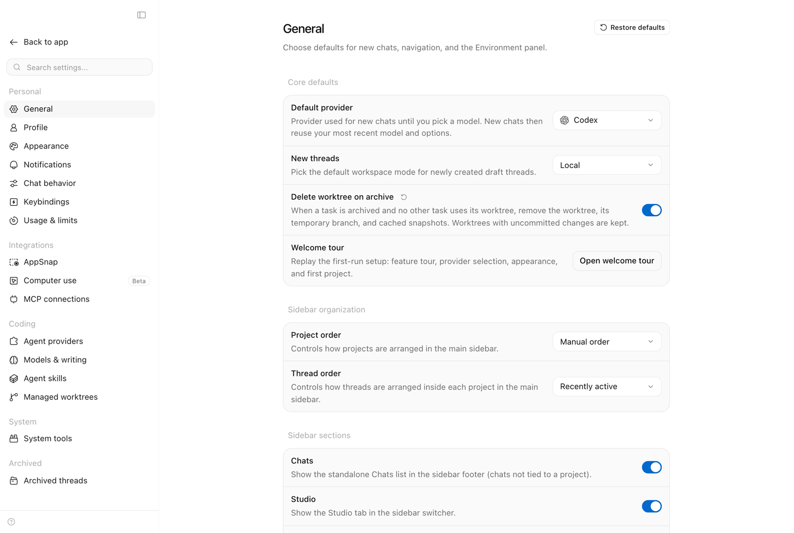

# Core concepts

Synara becomes much easier to use once its ownership model is clear: **each task owns one body of
work** — its conversation, provider session, working environment, tool activity, and Git changes.

## The hierarchy

| Concept          | Meaning                                                             |
| ---------------- | ------------------------------------------------------------------- |
| Workspace        | The complete Synara application and the projects available in it    |
| Project          | A local folder, preferably a Git repository                         |
| Task             | One durable unit of work inside a project                           |
| Goal             | An explicit persistent objective attached to one task               |
| Turn             | One user instruction followed by the provider's work and response   |
| Provider session | The coding-agent session attached to the task                       |
| Environment      | The local checkout or isolated Git worktree where the task operates |

A project can contain many tasks. Each task has its own transcript and provider lifecycle. Tasks
using separate worktrees also have separate working directories and branches.

New thread (⌘N on macOS, Ctrl+N elsewhere) reopens an unsent draft. Once a send is in progress,
including worktree preparation, it opens another draft while the original send continues.
The task appears in the sidebar before Git preparation finishes, with a **Preparing worktree**
indicator. Its provider session starts only after the worktree is ready. If preparation fails or
is cancelled, the task and its prompt remain available for retry.

## The main surfaces

- **Sidebar** — projects, spaces, tasks, and activity requiring attention. The rail
  is a fixed column of icon tabs for Home, Spaces, Kanban (Tasks in Beta), Code review, Automations, Hubs (Beta), and
  Settings, with the thread panel beside it and the route shown as a card inset from the window.
  Open saved threads appear as tabs across the top of the chat. Unsent drafts stay out of
  the tab strip until they become saved threads on the first send. Saved tabs remain
  available to return to while an unsent draft is on screen, including in the editor view.
  Archiving the open thread or marking it **Done** opens the most recently used unfinished chat
  across projects, ordered by its last human message (or creation time). If none remains, New
  thread reopens an unsent draft. Actions on other threads keep the current chat open.
- **Code review** — pull requests and issues from the GitHub repositories of your projects, with a
  detail pane and three actions on every item (see [Code review](#code-review))
- **Tasks** (Beta; Stable keeps Kanban) — a to-do list for anything you need to do, with or without
  a project. Select a to-do to open its floating card, then hand it to an agent with **Start**: pick the
  provider, model, and effort, the project or folder it works in, and a new or existing chat. The
  agent receives the to-do's current title and note. The to-do then follows the chat's status — Running, Needs you, Review when the agent finishes, or
  Failed — and its details show the agent's recent activity, let you approve a pending request
  without opening the chat, and show the agent's latest reply for review before you mark it done. A
  List / Kanban switch in the header opens the Kanban board instead, and the Tasks entry remembers
  the view you picked.
- **Kanban** — the Attention view groups chat cards into Draft, In Progress, Awaiting you,
  and Done; Classic keeps the three-column layout. Approval/input requests, failures, and
  stalled work surface in Awaiting you. Needs review requires a live-confirmed open PR in a
  dedicated worktree. Drafts can be sent as persistent goals. Kanban and Tasks reuse the
  same draft dispatcher, preserving provider-instance selection and edits made while sending.
  The `synara_*_kanban_*` gateway tools read and drive durable cards within the caller's
  ordinary project; local composer drafts remain client-only. Gateway draft creation uses
  the local checkout; isolated worktree callers can create a task instead. These tools do
  not change the Beta-only Tasks to-do records.
- **Inbox** (Beta) — today’s due and overdue to-dos, tasks with an agent, and tasks finished
  since the working day began at 4am, beside the day’s agent recap. Add a task here to make it due
  on today’s calendar date, or select it to edit and delegate through the same card as Tasks.
  **All tasks** opens the complete backlog.
- **Conversation** — user messages, agent responses, plans, tools, approvals, and subagent activity.
  In a split view, dragging the divider resizes both chats continuously; releasing it saves the layout.
- **Composer** — objectives, attachments, provider selection, model selection, and task controls
- **Terminal** — a real shell opened in the task's working directory
- **Browser** — a shared live page surface for previews, semantic automation, and page-declared
  WebMCP tools
- **Diff and Git views** — the changes produced in the environment and the path toward committing or
  opening a PR

You do not need every surface open at once. Bring each one in when it answers a question: what is
running, what changed, whether the UI works, or whether the task is safe to ship.

## Projects

A project is the folder Synara works with.

The project picker shows registered projects and local folders. Creating a task worktree does not
add another project entry. If the current draft already uses an unregistered folder, the picker keeps
that folder visible with its path.

Git repositories unlock the complete delivery workflow:

- Branches
- Worktrees
- Diffs
- Commits
- Pushes
- Pull requests

Non-Git folders can still be useful for simpler work, but they do not provide the same isolation and
review guarantees.

## Tasks and turns

A task is the durable container for one objective.

A turn is one cycle inside that task:

1. You send an instruction.
2. The provider plans or acts.
3. Tools and approvals appear in the transcript.
4. The provider completes, fails, or is interrupted.
5. You review the result and decide what happens next.

A long task can contain many turns. Keep follow-ups connected to the same objective; create another
task when the work needs a different owner, branch, or review boundary.

If a connection drops while sending, Synara shows **Checking message delivery…** while it checks the original
command's durable receipt. An accepted message is retained without resending it to the provider.
If it was not accepted, Synara records a rejection that also blocks a delayed copy, then restores
the draft for retry. This recovery requires a server advertising `orchestration.turn-dispatch-settlement`;
older servers retain their existing error handling. If recovery reaches a server without that capability,
Synara reports that delivery is still unknown; reconnect to an updated server and check the conversation
before sending again. Socket recovery restores active subscriptions
and reports the connection as open only after the feature socket answers.

Turn off **Settings → General → Move sent messages to top** to keep new messages at the bottom
of the conversation and follow replies as they stream.

For work that should continue across several turns, set a deliberate
[thread goal](https://www.trysynara.com/docs/features/thread-goals). A goal can continue after a
clean turn, but queued user work, approvals, questions, interruptions, failures, and pause rules
remain in control.

Use a [thread fork](https://www.trysynara.com/docs/workflows/forks) when a new task should inherit
the conversation or split from one exact turn. Use a
[handoff](https://www.trysynara.com/docs/workflows/handoffs) when another provider should continue
the same task and ownership boundary.

Use **Snooze** in a thread's context menu to return to it in 30 minutes, 1 hour,
2 hours, or tomorrow at 9am. It moves to **Snoozed** and leaves ordinary thread lists
and attention badges until the reminder is due. **Return now** cancels the snooze;
choosing another time reschedules it. Snoozing preserves any running agent work.
Sending a new message also returns the thread to the list.

When due, the thread returns to recent activity and Synara shows a reminder using
your notification settings. If Synara and its server are closed, the overdue
reminder is recovered when they start again.

In Beta, **Auto-fix CI** in the Environment panel's pull request menu watches open PRs
for this chat, including other PRs in its stack. One chat can own the active watch for a
PR. A paused watch releases ownership; resuming it requires that no other chat owns it.
The server checks every minute and starts at most one fix turn for each failing commit,
using the chat's permissions. It waits for active turns, background tasks, approvals,
questions, and Plan mode. Switching to another PR requires a clean working tree; the fix
request names the canonical GitHub PR and asks the agent to verify its commit before
editing and restore the original checkout afterwards. A failure streak allows three
attempts. Green checks reset the attempt budget even after a rerun on the same commit.
After a turn finishes, the watcher allows a minute for GitHub to report a pushed head.
If the head still has not changed and CI is not green, or a request has no accepted durable
command receipt after restart, it pauses with a transcript notice. Turn it
on again to resume. Turning it off cancels pending watch decisions, and closed PRs stop
being watched. Stable does not start this watcher or accept its RPC operations.

Sidechats keep the source chat's project, folder, branch, and Local/Worktree environment. Their
empty view shows the composer without the new-chat welcome screen or independent project, folder,
branch, Local/Worktree, or Temporary controls.

Sidechats inherit the source chat's selected permissions, including Full access. Approve for me
is preserved when the selected provider and model support it; otherwise the sidechat uses Ask for
approval. You can change a sidechat's permissions independently after creating it.

A sidechat can also stand alone, with no source chat: **Ask** on a Code review item opens one about
that pull request or issue. It has no transcript to import and no permissions to inherit, so it
starts in Ask for approval, runs in the project's own checkout without switching branches, and
is told to treat the item's text as untrusted reference data. Like any sidechat it stays out of
the thread list and expires after the inactivity window set in Settings → Conversation
(1 hour by default, 24 hours, or never). Its empty view likewise shows only the
composer and keeps the workspace assigned by Code review.

## Code review

Code review lists the open or closed pull requests and issues of the GitHub repositories behind
your projects: each project contributes the repository of its current branch remote (or
`remote.pushDefault`, then `origin`), and **Include fork upstreams** in Settings adds its other
GitHub remotes. Two projects on one repository share one list. Filters (kind, projects, state,
involvement, labels) stay local and are remembered; GitHub is refreshed about every five minutes
while the page is visible, on window focus, and with the refresh button.

**Merged** narrows the loaded closed list to merged pull requests. Its counts reflect matching
loaded rows, and its refresh uses the same closed cache. The first-50 cap applies to closed
pull requests before this local filter, so it does not fetch a separate page of 50 merged items.

Every item offers three actions:

- **Send to agent** opens a new draft thread in the item's project with the item attached as a
  card. A pull request card passes its URL to the agent, without copying its description or
  discussion into the prompt. Synara reuses an existing worktree for its branch. Otherwise it
  checks out the branch using the project's Local/Worktree preference, falling back to
  **Settings → General → New threads**. If that branch name belongs to a known different
  fork's worktree, Local reports the conflict; choose Worktree to keep the two separate.
  A progress notification shows checkout preparation and chat opening; background Git
  refreshes do not delay the prepared draft. You write the instructions and send; nothing
  starts on its own. When the repository belongs to several projects, you pick the project.

- **Ask** opens a standalone sidechat about the item in a dock beside it, so you never leave
  Code review. Asking again reopens the item's live sidechat; `mod+alt+s` toggles it and Escape closes
  it. In a chat thread's pull request panel, Ask uses that thread's own sidechat instead.
- **Open on GitHub**.

## Environments

A task runs in one of two common environments.

| Environment    | Use it when                                                                                                                                   |
| -------------- | --------------------------------------------------------------------------------------------------------------------------------------------- |
| Local checkout | One task owns the repository and you intentionally want it to edit the currently checked-out working tree                                     |
| Git worktree   | Another task may touch the repository, you want an isolated branch, or you want to discard an experiment without disturbing the main checkout |

A worktree is another working directory attached to the same Git repository. It shares repository
history while keeping files and branch state separate.

Read the [Git worktrees guide](https://www.trysynara.com/docs/workflows/worktrees) before starting
several tasks in the same repository.

### Cleaning up worktrees

Deleting a task offers to delete its worktree when no other task uses it. Turn on **Delete worktree
on archive** in **Settings → General** to remove a finished task's clean checkout after its Undo
period ends. If another task still refers to the checkout, the session has not stopped, or Git finds
uncommitted changes, the checkout stays. Automatic archive cleanup preserves its branch so commits
remain recoverable. Restoring an archived task later restores its conversation, but a removed
checkout must be recreated from that branch before work resumes. **Settings → Managed worktrees**
lists managed worktrees for explicit removal. Those removals also delete the temporary `synara/*`
branch, its empty managed folder, and recovery
snapshots cached for that path. Automatic retention keeps the 15 most recently archived worktrees
and snapshots older ones before removing them; those snapshots expire after 30 days.

## Providers, models, and sessions

A provider is the coding-agent runtime Synara operates, such as Claude Code, Codex, OpenCode, Cursor,
or another supported integration.

The provider supplies:

- Its authentication
- Its available models
- Its own tools and permissions
- Its provider-specific session behavior

Synara supplies the shared workspace around it:

- Durable tasks
- Conversation and activity presentation
- Terminals, browser, files, and diffs
- Git environments
- Approvals and user input
- Handoffs and orchestration

Each task owns a provider session. Available models and controls can differ because Synara discovers
capabilities from the installed runtime and account.

## Handoffs

A [provider handoff](https://www.trysynara.com/docs/workflows/handoffs) lets another supported
provider continue the same task and working environment using the context Synara passes to it.

Use a handoff when:

- Another provider is better suited to the next phase
- You want an independent implementation or review
- The current provider is unavailable or rate-limited
- You want to continue without manually rebuilding the task context

A handoff does not remove the need to inspect the diff or verify the new provider's work.

## Git, checkpoints, and review

Synara treats Git as the durable review and recovery layer.

The intended loop is:

1. Begin from a known state.
2. Let the task change the environment.
3. Inspect the diff.
4. Run verification.
5. Commit only the intended changes.
6. Push and open a pull request when appropriate.

Create PR can include uncommitted changes and create a feature branch from the default branch.
When you supply a PR title, Synara also uses it as the commit message unless a separate commit
message was supplied. Providing both the title and description skips text generation for this flow.

Failed commit, push, and PR actions show the failed step and a copyable error until dismissed.
Each action keeps its own error details when you switch workspaces and start another action.
Codex text generation stops on a terminal `ERROR: ... 401 Unauthorized` diagnostic; transport
fallback warnings remain recoverable. Cleanup preserves a recognized authentication error even
when its grace period extends past the request deadline, and reports termination failures. Check
the selected account or provider credentials in Settings before retrying. A failed PR step can
follow a successful commit or push, so inspect the current branch before retrying.

Synara's checkpoint and revert controls can help recover task work, but committed Git history remains
the strongest boundary for important changes.

## Hubs

A hub is a coordinated home for related work. You talk to one coordinator conversation, and it
answers directly or starts threads (tasks) that run in parallel — in the hub's own folder or in
linked repositories. Every thread in the hub receives the hub's instructions and memory, and
files the threads deliver collect in a Git-versioned Library. A hub needs no repository, so it
also suits non-code work. Delegations preserve the original request and attachments, and durable
task cards show their queue state and progress under the request. New Hubs run up to three workers
at once by default; the General settings allow one to eight. Read the [Hubs guide](./hubs.md) to set
one up.

## Parallel work

Parallelism is useful only when ownership is clear.

Good parallel tasks:

- Touch independent files or subsystems
- Use separate worktrees
- Have explicit objectives
- Produce independently reviewable results

Risky parallel tasks:

- Modify the same files
- Share one local checkout
- Depend on unstated assumptions from another task
- All attempt to "finish the feature" without distinct ownership

Read the [parallel agents guide](https://www.trysynara.com/docs/workflows/parallel-agents) before
scaling beyond one task.

## Useful shortcuts

`mod` means Command on macOS and Ctrl on Windows or Linux.

- `mod+n` — create a task
- `mod+j` — toggle the terminal drawer
- `mod+d` — toggle the diff view
- `mod+shift+b` — toggle the browser
- `mod+\` — split the current view
- `mod+1` through `mod+9` — open a numbered sidebar thread. Hold `mod` to show the
  default numbers in the classic and Activity views.

Every split chat has an **X** in its header to close it. Closing an ordinary pane keeps
the remaining chats and preserves focus on a surviving chat. Closing a forked Side
returns to its source; a standalone Side in a non-source pane returns to the split’s
source. Split headers keep the diff panel toggle without showing change totals,
and omit expand and replace controls.

Check the [keyboard reference](https://www.trysynara.com/docs/reference/keyboard-shortcuts) for the
complete current list.

> **The rule that matters most:** a task is complete only after you understand and verify its result
> — not when the provider reports that it is finished.

## File previews

File and explorer panels can expand across the chat area. Restore returns to the
split layout; closing the last maximized panel returns to the chat. Closing the
last panel in the ordinary split layout keeps the panel launcher open.

Editable workspace files autosave after a 400 ms pause in typing. Save or
Cmd/Ctrl+S saves immediately. The file editor, diff editor, and explorer share
the same buffer and writer for an open file. Successful saves update Unstaged
changes; they do not stage the file. Switching files, navigating to another
page, and sending a prompt wait for pending editor saves.

If a write fails or the file has changed on disk, autosave stops and keeps the
draft. Save errors stay visible until resolved. Retry Save after fixing the cause,
or use Reload from disk and confirm discarding the draft before leaving or sending. Reload
discards the draft; an explicit Overwrite action in the full editor bypasses the
version check. Drafts retained after a panel closes live only in the current app
session, so they are not crash recovery backups.

Markdown previews support basic workspace Wiki links: `[[notes/design]]` opens
`notes/design.md` from the workspace root, and `[[notes/design|Design notes]]`
uses an alias. Include the extension for other files, such as `[[guide.pdf]]`.
Regular Markdown links remain relative to the document directory. Code, escaped
Wiki syntax, embeds, and heading/block links are left literal; this is basic file
navigation rather than full Obsidian support.
