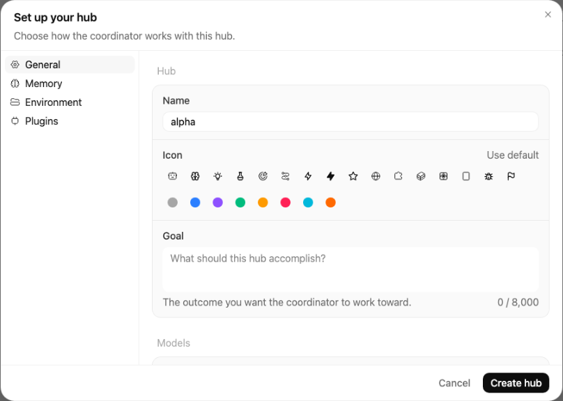
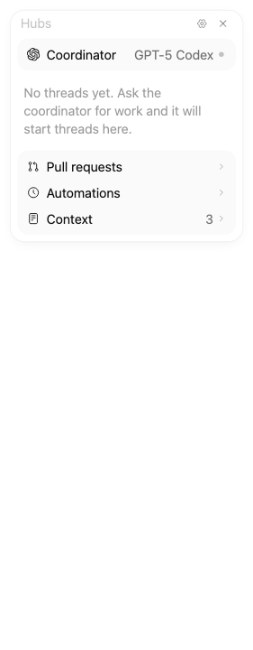
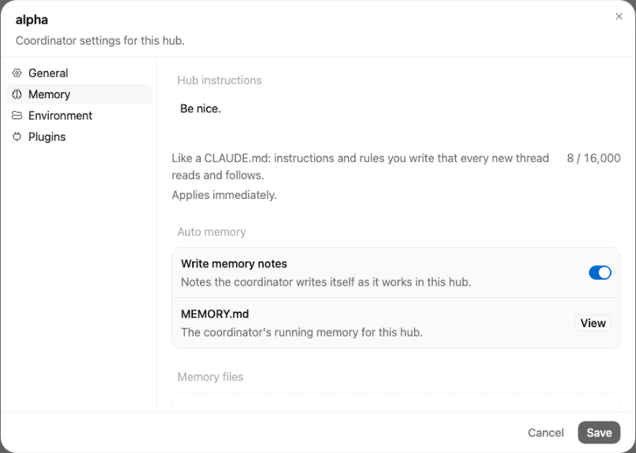
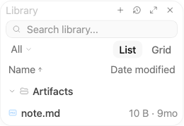
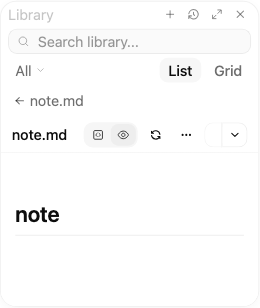

# Hubs

A hub is a shared home for related work. It has **one coordinator conversation** that you talk
to, and **many threads** that do the work in parallel. Every thread in the hub starts from the
same instructions and memory, and files the threads deliver land in one shared Library.

A hub does not need a repository. It works just as well for research, writing, planning, or any
other non-code work.

> **Synara Beta only.** Hubs ship in Synara Beta. Stable does not show them, and any hub folder
> there appears as an ordinary project.

> **Compatibility:** Existing hubs keep their files and saved settings. The on-disk parent folder
> remains `~/Documents/Synara/Groups/`; the stored feature key and API identifiers retain `groups`.
> The canonical navigation route is `/hubs`; existing `/groups` and `/studio` links redirect there.

> **Before you begin:** Hubs appear under the **Hubs** tab of the sidebar switcher. If you do
> not see the tab, open Settings → **Sidebar sections** and turn on **Hubs** ("Show the Hubs
> tab in the sidebar switcher.").

## Hub or ordinary thread?

| Use an ordinary project thread when           | Use a hub when                                                    |
| --------------------------------------------- | ----------------------------------------------------------------- |
| The work is one objective in one repository   | The work spans several threads, repositories, or kinds of work    |
| You want to drive a single agent turn by turn | You want one place to ask for work and get status back            |
| Instructions live in that repository          | Several threads should share the same instructions and memory     |
| Results are a diff you review in place        | Results include files (reports, bundles, charts) you want to keep |

## Create a hub

1. Open the **Hubs** tab in the sidebar and choose **New hub**.
2. Type a **Hub name** and choose **Create hub**. Synara creates a folder for the hub under
   `~/Documents/Synara/Groups/`.
3. The **Set up your hub** dialog opens. On **General**, set the goal, the hub's icon and
   color, and the coordinator and thread models.
4. Optionally add **Hub instructions** on **Memory** and link repositories on **Environment**.
5. Choose **Create hub**. Setup does not launch a model.

If you choose **Cancel** on a brand-new hub that has no threads, files, or linked repositories
yet, Synara asks **Discard this hub?** Choose **Discard hub** to remove it, or **Keep hub** to
finish setup later. A hub you keep shows its name with **Set up** in the sidebar; click it to
reopen setup.



The coordinator conversation opens with a welcome message. Until you send your first message, a
**Suggestions** row offers three shortcuts: **Connect repositories**, **Add a goal**, and **Write
instructions**. Each one opens the matching settings section, and hides once that setting is filled.

## Hubs in the sidebar

Each hub is a single row: its coordinator. There is no separate folder row.

- **Click the row** to open the coordinator conversation.
- **The chevron** on the left shows or hides the hub's threads (**Show threads** / **Hide
  threads**). The list includes threads the coordinator started in linked repositories; those rows
  are labelled with the repository name.
- **An amber dot** ("A thread needs you") means a thread in the hub is waiting on you.
- **Pin** the coordinator with the pin that appears on hover (**Pin coordinator**), or right-click
  the row and choose **Pin coordinator**. Pinned coordinators stay in the pinned section at the
  top of the sidebar.
- **Right-click** the row for **Edit coordinator** (opens hub settings), **Edit name**, **Open
  in Finder**, and the other folder actions.
- Archived hubs are listed under **Archived hubs**, each with an **Unarchive** button.

To change the hub's icon or its color, use hub settings → **General** → **Icon**. The same icon
marks the hub in the sidebar and in the chat header.

## Talk to the coordinator

The coordinator directs work; threads do the work. It does not write application code itself.
Each message you send ends up in one of three places:

- **Answered in place**: quick questions, status checks, and short explanations.
- **Sent to an existing thread**: a follow-up for a thread already working in that area, instead
  of a duplicate.
- **Started as new threads**: one thread per independent task, started in parallel.

When a request could mean either "do it now" or "just suggest", the coordinator proposes a short
list of suggested threads (title, repository, one-line brief) and waits for your confirmation.
Tell it once if you always want this, and it will remember.

The coordinator's own Synara tools (starting threads, saving memory, adding Library files, linking
repositories) run without asking for approval while the hub is active. File edits, shell
commands, and every other tool still ask. In a paused or archived hub, every tool asks again.

After it starts threads, Synara watches them for you (see
[How monitoring works](#how-monitoring-works)). Status updates appear in the coordinator
conversation as part of its reply, each with a link to the thread.

Inside a thread the coordinator started, the task is labelled with the hub, for example **Sent by
the Release Synara coordinator**.
Click it to go back to the coordinator conversation.

Useful requests:

```text
How is everything going?
Run at most 3 threads at a time.
Propose threads before starting them.
Link the repository at ~/code/api to this hub.
Every Monday, summarize open pull requests.
```

You can also start a thread in a hub yourself: open a new chat while the hub is active. The
hub's **Thread model** and **Thread effort** are only the starting default for each new chat.
Pick any other model in the composer for that chat. If the default provider is not installed or
signed in, the composer keeps a model that works, so sending is never blocked. The chat still
receives the hub's instructions and memory.

## Delegated requests and the work queue

A delegated task stores the original human text and attachment references alongside the coordinator's
brief. The server resolves those originals from the conversation. Workers receive the Hub's shared
instructions and memory; the Playbook and monitoring reports belong to the coordinator. Keep source
messages with files until queued tasks start: deleting or reverting a source message can remove an
attachment before it is copied to the worker, causing that task to fail explicitly.

Task cards appear below the original request. They show queued, starting, working, waiting, idle,
completed, failed, or cancelled work and open the worker conversation once it exists. A worker can
publish a checklist that survives reloads and restarts. Checking every step does not by itself mark
the task complete. Queued and starting tasks also appear in the Hubs panel.

New Hubs run **3 workers at once**. Change **Parallel threads** in Hub settings → **General** to
choose a limit from 1 to 8. Existing Hubs retain their saved limit, with an effective ceiling of 8. Excess new tasks wait in a
persistent queue and start as slots become available. Pausing or archiving a Hub stops new queue
starts. Cancelling queued work through the coordinator prevents it from starting.

Repository tasks default to isolated worktrees; general Hub work and non-Git folders use the local
workspace. An explicit environment choice still applies. Repeating the same delegation after a
coordinator wake reuses its saved task cards. An interrupted creation is reconciled conservatively;
a failed creation remains visible instead of silently spawning a replacement. If cleanup cannot
finish, the task retains its reserved slot until startup recovery confirms cleanup.

The sidebar's attention indicator includes the Hub's owned workers in linked repositories and
workers whose recovery needs your help. For a closed Hub, recovery attention refreshes on return
to the window and within 30 seconds while the window is visible.

## How monitoring works

Monitoring is done by the Synara server, by fixed rules. It does not depend on the model
remembering to check.

- **Every thread the coordinator starts is tracked**, whether or not the hub has a goal.
- **Status updates.** When a tracked thread finishes, stops, fails, is interrupted, loses its
  session, or starts waiting for your approval or input, a short line appears in the coordinator
  conversation, for example "Mars rocket research finished", "… is waiting for your approval",
  "… needs your input", or "… was interrupted". A finished thread shows the first line of the
  result it filed, plus its pull request link when it has one. If it filed no result, the line says
  "finished — no result filed".
- **One summary per request.** When a request started more than one thread and all of them are
  done, one summary appears: "All 3 threads finished: …" (or "All 3 threads are done: …" when
  some failed or were interrupted). It lists each thread with its result or outcome and a **PR**
  link. Threads still waiting on you do not count as done.
- **Stuck threads.** The server reacts to events as they happen, and runs a health check every
  minute for the rest:

  | Situation                                                    | What Synara does                                                |
  | ------------------------------------------------------------ | --------------------------------------------------------------- |
  | A turn fails, is interrupted, or the session errors or stops | Reports it and wakes the coordinator                            |
  | The session died but still looks "running" (after 90 s)      | Reports "lost its session" and wakes the coordinator            |
  | Waiting on an approval or your input for over 5 minutes      | Reports it once. It never approves or answers for you           |
  | No session or first turn within 3 minutes of starting        | Re-sends the thread's task once                                 |
  | Running with no real activity for 10 minutes                 | Sends the thread a nudge asking for a one-line status           |
  | Still quiet 5 minutes after the nudge                        | Interrupts the turn and re-sends the thread's task once         |
  | A single tool call running for over 45 minutes               | Nudges and reports, but never interrupts a running tool         |
  | Automatic recovery used up (2 attempts)                      | Marks the thread **Waiting on you**, wakes the coordinator once |

  A **Waiting on you** line has three buttons: **Retry** (re-sends the task), **Stop worker**, and
  **Open thread**. After that, Synara takes no more automatic action on that thread.

- **Your turns are yours.** If you send a message in a thread yourself, Synara never nudges,
  interrupts, or re-sends that turn.
- **Background check-ins stay out of the chat.** The coordinator also runs short background
  check-ins when hub events happen. They never appear in the conversation; what each one
  concluded goes to the hub's activity log.
- **Paused or archived hubs** keep tracking thread state but post no status lines.

## The Hubs panel

Open the **Hubs** panel with the **Hub** button in the chat header. It opens by default in a
hub's chats, including a new hub's first visit, until you close it; Synara remembers the close
for that hub.

From top to bottom:

- **Header**: **Pause goal** / **Resume goal** (only when the hub has a goal), **Hub
  settings** (gear), and **Close**.
- **Coordinator**: its model and a status dot (**Needs you**, **Working**, **Paused**, **Stopped**,
  or **Idle**), with the coordinator's short summary of what matters now under it, refreshed after
  coordinator turns. Click it to open the coordinator conversation.
- **Threads**, always shown: one line per thread, grouped by state, so you can see at a glance what
  is working, what is done, and what is waiting on you. **Resolved** starts collapsed.
- **Pull requests**, **Automations**, and **Context** rows, each with a count. Click a row to open
  that section in place under it; only one is open at a time.

The panel grows with its content up to a height based on your screen; past that, its body scrolls.

The sections:

- **Threads**: every thread in the hub, sorted into the states below. Right-click a row (or hover
  it and use its **…** button) for **Mark resolved** (or **Reopen**) and **Open in split view**.
- **Pull requests**: PRs opened by hub threads, each with an **Open on GitHub** link.
- **Automations**: scheduled work that belongs to the hub, with its last run and an on/off
  switch.
- **Context**: the hub's Instructions, Decisions, and Playbook files. Only Instructions can be
  edited here.

| State                | Meaning                                                                                            |
| -------------------- | -------------------------------------------------------------------------------------------------- |
| **Waiting on you**   | Asked for an approval or input, its session or turn failed, or monitoring marked it Waiting on you |
| **Working**          | Starting or actively running a turn                                                                |
| **Ready for review** | Not running and has an open, non-draft pull request                                                |
| **Idle**             | Not running and has nothing waiting                                                                |
| **Resolved**         | Archived, its task is done or cancelled, or its PR was merged or closed (collapsed)                |

Threads in linked repositories appear here too, labelled with their repository.



## Instructions and memory

Every turn of every thread in the hub, whether the coordinator started it or you did, and
including threads in linked repositories, receives a context packet with:

- The hub **instructions**
- The hub **goal**, if you set one, plus the hub's decisions and open tasks
- The **MEMORY.md** index of shared hub memory
- The list of **linked repositories** and the **Library** location
- The hub's default thread model

Edit these in hub settings → **Memory**:

- **Hub instructions**: like a `CLAUDE.md`, rules every new thread reads and follows (up to
  16,000 characters). Changes apply immediately.
- **Write memory notes**: notes the coordinator writes itself as it works. While this is on,
  per-thread memory files (listed under **Thread memory**) are also added to the packet. The
  MEMORY.md index is sent either way.
- **MEMORY.md**: choose **View** to read the coordinator's running memory.
- **Memory files**: every saved memory note. Type in the note box (for example, "Note that
  releases go out on Tuesdays") to add one yourself. Your note is added to the MEMORY.md index
  right away, so every thread sees it on its next turn.

**How "remember" works.** When you tell the coordinator a preference or a fact ("always use the
small model for reviews"), it saves a note and adds one line to the `MEMORY.md` index. A
near-identical note updates the existing file instead of creating a second one. Any hub thread
can remember or forget notes the same way. Ask the coordinator to forget a note when it is stale.



## The Library

The Library is a folder of files for the hub, versioned as a Git repository. Every change is a
commit. Open it with the **Library** button in the chat header.

- **+** (Add files) in the Library header uploads files. Right-click a folder for **Upload here**.
- Search, filter by type (**All**, **Documents**, **Images**, **Code**, **Other**), sort by name or
  date modified, and switch between **List** and **Grid**.
- Click a file to preview it in the panel.
- Right-click an entry to **Rename**, **Delete**, or see its **History**. The **History** button in
  the Library header shows the history of the whole Library.
- **History** lists every version. Choose **Restore** to bring back an earlier version or a
  deleted file.



Choose **Expand** in the Library header to make the panel as tall as the chat column and much
wider, which is easier for reading documents. **Collapse** returns it to its compact size.



Threads deliver files to the Library themselves: when a thread produces something worth keeping,
the coordinator asks it to add the file, then links the Library path in its reply. A thread can
only add files from its own workspace.

To back up the Library, set a **Git remote** in settings → **Environment** → **Library hosting**
and turn on **Push on change**. Pushes happen in the background and never block a write. The
Library shows **Pushed**, **Not pushed yet**, or **Push failed**. Pushes are non-interactive, so
the remote must already work with your saved SSH key or Git credentials.

## Linked repositories

Link an existing Synara project to let the coordinator start threads in it. Use **Add repository**
in settings → **Environment**, or ask the coordinator to link it. Only you can unlink a repository
(**Remove**). Linking and unlinking apply immediately.

The coordinator can start threads only in the hub folder or in a linked repository. It uses the
hub folder for non-code work such as notes, research, and planning. In a linked repository,
it can send follow-up turns only to workers owned by this hub, not to unrelated chats or another
hub's workers. Removing the repository link also removes that access. Workers cannot start or
steer additional worker threads, including when their task has finished or no task was created.

## Lifecycle

These controls live at the bottom of settings → **General**, under **Lifecycle** and **Danger
zone**.

| Action                  | What happens                                                                                                 |
| ----------------------- | ------------------------------------------------------------------------------------------------------------ |
| **Pause hub**           | Interrupts running threads and stops new coordinator wakes and hub automations. **Resume** restores them     |
| **Restart coordinator** | Stops and restarts the coordinator's session. The transcript is kept. Not available while paused or archived |
| **Archive hub**         | Archives every thread and hides the hub. Find it under **Archived hubs** → **Unarchive**                     |
| **Delete hub**          | Type the hub name to confirm. Deletes the hub, its coordinator, context, and automations                     |

When you delete a hub:

- Linked repositories and their threads are never deleted.
- The default Library folder is moved to the trash when possible.
- A Library folder you chose yourself is never moved or deleted; Synara tells you where it was left.
- The hub folder under `~/Documents/Synara/Groups/` is removed only when it holds nothing but the
  files Synara created there. If you or a thread added anything, the folder is kept. The delete
  notice lists every kept folder, with a copy button for each path.

**Change the coordinator's model.** Pick a new **Coordinator model** in settings → **General** →
**Models** and save. The coordinator moves to that model and keeps its conversation history. If
that provider is turned off or not installed, the save is refused and the coordinator keeps running
on its old model.

**Continue as a hub.** Right-click an ordinary thread and choose **Continue as a hub**. Synara
creates a new hub named after the thread, links the thread's project, and opens hub setup. The
coordinator is then asked to read the thread and continue its work. **Move to hub…** does the
same for an existing hub.

**Hand off.** Hub threads can hand off to another provider, and the new thread stays in the
hub. Workspace hand off (to a new worktree or to local) is not available for hub threads. The
coordinator cannot be handed off.

## Settings reference

Open settings from the gear in the Hubs panel (**Hub settings**), or right-click the hub in
the sidebar and choose **Edit coordinator**. The model pickers list every provider's models, just
like the composer.

| Section         | Settings                                                                                                                                   |
| --------------- | ------------------------------------------------------------------------------------------------------------------------------------------ |
| **General**     | Hub (Name, Icon and color, Goal); Models (Coordinator and Thread model and effort); Lifecycle                                              |
| **Memory**      | Hub instructions; Auto memory (Write memory notes, MEMORY.md); Memory files; Thread memory                                                 |
| **Environment** | Linked repositories; Workspace (Hub folder, Worker environment: Local or Worktree); Library hosting (Location, Git remote, Push on change) |
| **Plugins**     | Plugins discovered from the hub's folder                                                                                                   |

## Where data lives on disk

| Data                            | Location                                                             |
| ------------------------------- | -------------------------------------------------------------------- |
| Hub folder                      | `~/Documents/Synara/Groups/<group-name>/`                            |
| Instructions, memory, decisions | `~/.synara/userdata/project-context/<project-id>/` (Markdown mirror) |
| Library (default)               | `~/.synara/userdata/project-context/<project-id>/library/`           |
| Library (custom)                | The folder you chose in **Library hosting** → **Location**           |

Synara's database is the source of truth; the Markdown files are a mirror. `~/.synara` moves if you
set `SYNARA_HOME`.

## Limits and troubleshooting

- A hub runs at most 8 threads at once and starts at most 8 new threads per coordinator turn.
- The context packet is capped at 32,000 characters. Past that, lower-priority sections (memory
  files, decisions, tasks) truncate first. Instructions and the MEMORY.md index are always kept.
- A single Library add is limited to 256 MB. The MEMORY.md index keeps the newest 256 entries.
- Hub name: 160 characters. Goal: 8,000. Instructions: 16,000.
- Library remotes must be `https://`, `ssh://`, or `git@host:path`.
- **No Hubs tab**: turn on Settings → **Sidebar sections** → **Hubs**.
- **Restart is greyed out**: resume or unarchive the hub first.
- **Push failed**: hover the pill to see the error; failed pushes retry with a growing delay up to
  10 minutes.
- **A thread is stuck on Waiting on you**: open the coordinator conversation and choose **Retry**,
  **Stop worker**, or **Open thread** on that thread's line.
- **A paused or archived hub is missing from Move to hub…**: only active hubs are listed.

## How Hubs compare to Claude Code and Cursor Projects

Hubs follow the same idea as Claude Code
[Projects](https://code.claude.com/docs/en/claude-projects) and Cursor Projects: one place that
holds shared instructions, memory, and files for related work. Synara adds a coordinator that starts
threads for you, server-side monitoring that reports on and recovers those threads, a live panel of
every thread and PR, and a Git-versioned Library. Threads can use any provider Synara supports, and
a hub can span several repositories or none.
