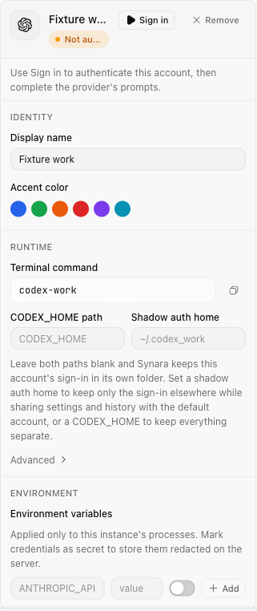
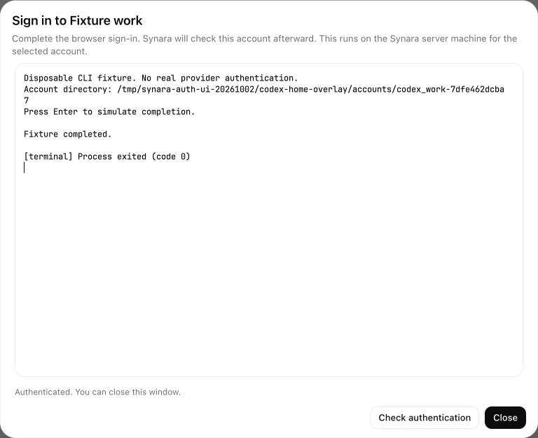

# Provider sign-in evidence

These images show the new flow before and after completing sign-in with a disposable Codex CLI fixture in an isolated local Synara instance. They are authentication-state comparisons, not screenshots of the previous application version.

| Before completing sign-in                                                              | After completing fixture sign-in                                                       |
| -------------------------------------------------------------------------------------- | -------------------------------------------------------------------------------------- |
|  |  |

The fixture verified the UI, WebSocket, server-owned PTY and account-status path. Closing an active sign-in terminated its process; authentication output was not persisted to terminal logs. No real provider credentials were used. Live provider OAuth and packaged Windows behavior remain unverified.
